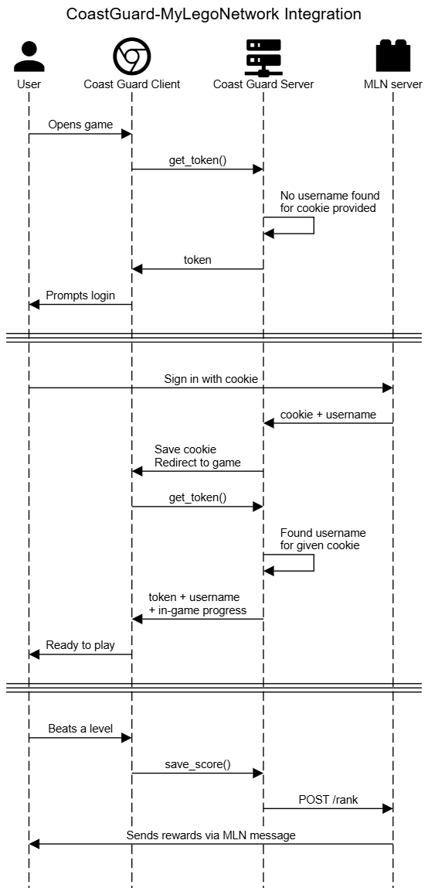

# My Lego Network Integration

The Coast Guard game can integrate with My Lego Network for two purposes:
- saving data
- sending MLN rewards to the user based on in-game rank

The client itself (the Flash-based parts) have no way to communicate with MLN directly. Instead,
the client asks for a `<loginurl>` and `<username>` in its initial `InfoRequest`. If there is no
username present, the client will prompt the user to go to login page directly. That request sends
a cookie called `sessionid` in the query parameters. After signing in, MLN sends back that cookie
along with the username to the Coast Guard server, which can now associate the two together and
redirects the browser back to the game.

Now, the client can ask the server for the username, which the server knows because it remembers
the client's cookie, and returns it in the initial InfoRequest response. The client will skip
prompting for login, and when a new rank is acheived, the client can notify the server. The server
will then notify MLN that the given user achieved the given rank, and MLN can reward the user with
badges and send other messages while the user continues to play.

Authenticity is guaranteed because: 

- the client never gets the user's MLN credentials
- the server has a secret key that is used when communicating to MLN but is **not** sent to the client

This process is very similar to OAuth, in the sense that the client only communicate with its own server, and never MLN. Instead, the Coast Guard server is trusted directly by MLN, and MLN can check that all API requests have the secret key it's expecting. MLN can revoke this trust at any time by changing its secret key.

Here's how that process looks like[^1]



## MLN API Endpoints

### POST /api/coastguard/rank

#### Request Body

```json
{
    secret: string,
    username: string,
    rank: int,  // must be between 1 and 5, inclusive
}
```

### Responses

- 200 OK: Rewards will be sent if needed
- 400 Malformed Request: Invalid secret or rank (must be between 1 and 5)
- 401 Unauthorized: Unknown username or secret

[^1]: The source for this diagram is in `diagram.txt`. Paste it into https://sequencediagram.org/ to make changes
